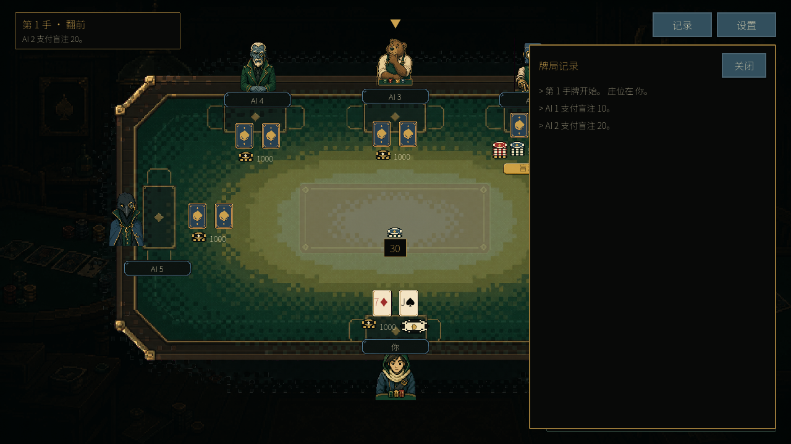
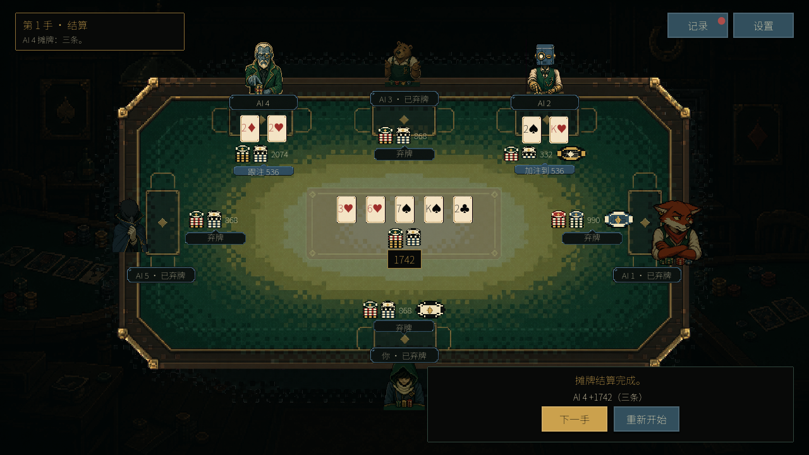
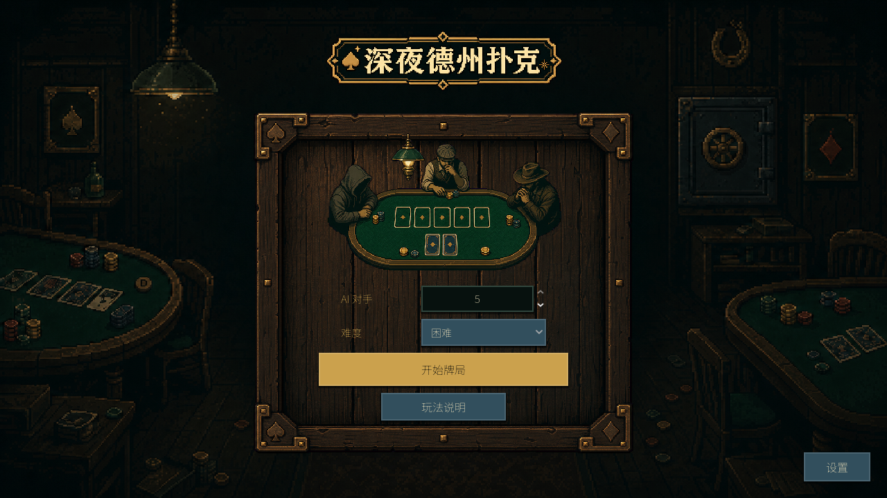

**English** · [简体中文](README.zh-CN.md)


# Your seat at the table is always open.

A free, single-player Texas Hold’em game for browsers, Windows and macOS. Desktop downloads work offline. Sit down with up to five AI opponents, read the table, and decide when to fold, call, or put your whole stack on the line.

**[Play or download on itch.io](https://jerryszz02.itch.io/poker-game)** · **[Earlier GitHub releases](https://github.com/Jerryszz02/pokerGame/releases/latest)**

**Single player · 1–5 AI opponents · Four difficulty levels · English / Simplified Chinese**

**v1.3.0 is available on itch.io**, with browser play, Windows/macOS downloads, **English / 简体中文** switching, lounge music and card/chip sounds. Click or press a key to start browser audio. The new release adds opponent-style selection, Hell difficulty, local coaching, replay reviews and player-style radar. GitHub Releases currently retains v1.2.0; download v1.3.0 from itch.io. See the [current status and verification](docs/planning/README.md).


*The river is out. The next move is yours. Actual gameplay; the interface is in Chinese.*

## Play the table your way

- **Choose your company.** Play heads-up or fill the table with five AI opponents. Pick Easy, Medium, Hard, or Hell before you start.
- **Watch how they bet.** On Hard, opponents have different betting tendencies, from cautious players to aggressive raisers and persistent callers.
- **Win the last chip.** Choose 1,000, 2,000, 5,000, or 10,000 starting chips and fixed blinds of 5/10, 10/20, 25/50, or 50/100. Keep playing hands until you own the table—or your stack runs out.
- **Learn and review.** Complete seven interactive tutorials, pause between practice hands, replay completed hands, and track local statistics and achievements.
- **Set your own pace.** Switch between normal and fast actions, pause when you need a break, and check the current hand’s action log.
- **Keep it local.** No game account, real-money wagering, or background data collection. Desktop play works offline; browser play needs a connection to load. Your settings and completed-hand statistics stay on your device.

## From the first bet to the showdown



*Check who acted and how much they put in with the current hand’s action log.*



*Follow each hand from the blinds to the reveal, including all-ins, side pots, and split pots.*



*A quiet, lamp-lit poker room. Choose your opponents and take a seat.*

## Download and take a seat

Get the v1.3.0 desktop ZIP for your system from [itch.io](https://jerryszz02.itch.io/poker-game), or play in your browser there. [GitHub Releases](https://github.com/Jerryszz02/pokerGame/releases/latest) currently provides the older v1.2.0 packages. You do not need the Godot editor, .NET, or this source repository to play.

| System | Download | Start playing |
| --- | --- | --- |
| Windows x64 | `poker-game-windows-x64.zip` (version 1.3.0) | Extract the whole ZIP, then open `PokerGame.exe`. |
| macOS | `poker-game-macos-universal.zip` (version 1.3.0) | Extract the ZIP, then open `PokerGame.app`. |

Use a display area of at least **1280 × 720** and a mouse. The macOS package contains Apple Silicon and Intel binaries; Intel Macs have not been separately validated. Windows builds are unsigned, and macOS builds are not Apple-notarized, so your system may show a first-launch security prompt. See the [release notes and validation](docs/releases/1.3.0.md) before opening the download.

**A quick guide to the Chinese buttons:**

| In the game | Meaning |
| --- | --- |
| 新手教程 / 自由对战 / 练习对局 | Tutorial / Free play / Practice |
| 弃牌 / 让牌 / 跟注 | Fold / Check / Call |
| 加注到 / 全下 | Raise to / All-in |
| 下一手 / 设置 / 记录 | Next hand / Settings / Action log |

**Before you leave a match:** settings and completed-hand statistics are saved, but an unfinished match is not. You can pause while the game is open; returning to the menu or quitting abandons that match.

## Tell us about your game

Found a confusing hand or a bug? [Open an issue](https://github.com/Jerryszz02/pokerGame/issues) with your game version, operating system, opponent count, difficulty, and a screenshot or steps to reproduce. You can also leave feedback on [itch.io](https://jerryszz02.itch.io/poker-game).

The game and this page include AI-generated artwork. Gameplay screenshots show the actual game; the title banner is promotional artwork. See [third-party notices](THIRD_PARTY_NOTICES.md) and [page asset sources](docs/storefront/README.md).

<details>
<summary><strong>For developers: run from source</strong></summary>

Tutorials, configurable stacks/blinds, saved replays and local statistics/achievements are included in v1.1.0. Version 1.3.0 adds local practice coaching, replay decision analysis, Hell difficulty and a descriptive six-axis player radar. Opening a replay automatically shows a local rule-based written review from the numerical analysis. An available owner-operated Cloudflare service can replace it with cloud prose; otherwise the local review remains usable offline. Players do not configure credentials; service setup is documented in the [runbook](docs/runbook.md#cloudflare-文字复盘服务). See the [coach/radar plan and verification](docs/planning/coach-radar-plan.md); the v1.3.0 itch.io channels contain these changes. For current source and release boundaries, see the [status and documentation index](docs/planning/README.md).

Built with Godot 4 and GDScript. Release builds use **Godot 4.7.2 standard**, with no .NET requirement. On macOS/Linux:

```sh
GODOT_BIN="$(python3 tools/bootstrap_godot.py)"
"$GODOT_BIN" --path .
```

Alternatively, import `project.godot` in Godot 4.7.2 and run `scenes/main.tscn`.

```sh
python3 tools/verify.py --godot "$GODOT_BIN"
```

[Player guide (Chinese)](docs/player-guide.md) · [Runbook](docs/runbook.md) · [Architecture](docs/architecture.md) · [Planning and acceptance](docs/planning/README.md)

</details>
