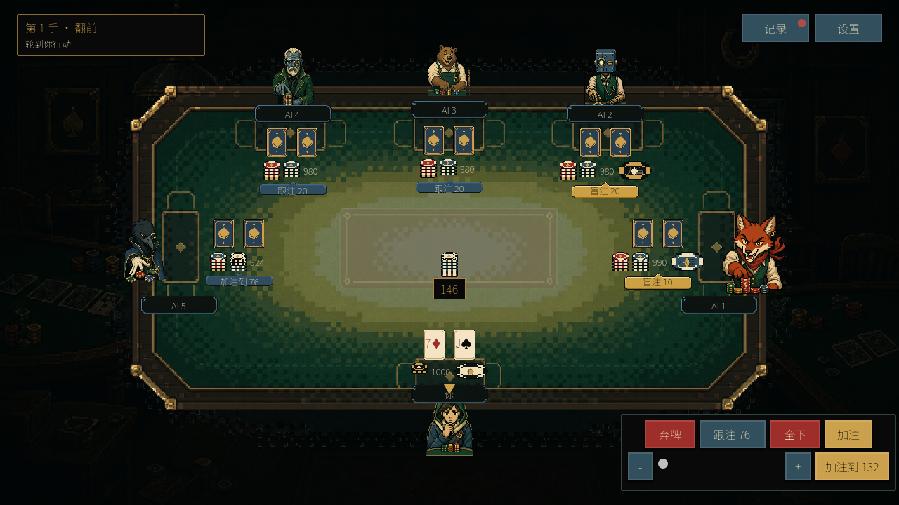

[English](README.md) · **简体中文**


# 牌桌的座位永远为你留着。

一款免费、离线的德州扑克游戏，支持 Windows 和 macOS。与最多五名 AI 对手同桌，读懂牌桌，决定何时弃牌、跟注，或是把全部筹码压上。

**[在 itch.io 下载](https://jerryszz02.itch.io/poker-game)** · **[从 GitHub 下载](https://github.com/Jerryszz02/pokerGame/releases/latest)**

**单人游戏 · 1–5 名 AI 对手 · 三个难度等级 · 简体中文界面**

游戏菜单、操作按钮和帮助目前均为 **简体中文**。


*河牌已发出，下一步由你决定。实际游戏画面。*

## 按你的方式打牌

- **选择你的对手。** 可以单挑，也可以凑满五名 AI 对手；开局前选择简单、普通或困难。
- **观察他们的下注方式。** 困难难度下，对手各有不同的下注倾向——从谨慎型玩家，到激进的加注者，再到一直跟注的玩家。
- **赢下最后一枚筹码。** 每人从 1,000 筹码开始，盲注固定为 10/20。一直打下去，直到赢下整桌——或是筹码耗尽。
- **按自己的节奏来。** 在普通和快速动作之间切换，需要休息时暂停，并随时查看当前牌局的行动记录。
- **全程本地。** 无需游戏账号、网络连接、真钱下注，也不做后台数据收集。你的设置和已完成牌局的统计都保存在本机。

## 从第一注到摊牌



*选择加注、跟注，或是退出这手牌。*


*从盲注到亮牌，跟随每一手牌，包括全下、边池和分池。*


*安静、灯光柔和的扑克房间。选择对手，落座开打。*

## 下载并落座

从 [itch.io](https://jerryszz02.itch.io/poker-game) 或 [GitHub Releases](https://github.com/Jerryszz02/pokerGame/releases/latest) 获取适合你系统的桌面 ZIP 包。游玩无需 Godot 编辑器、.NET 或本源码仓库。

| 系统 | 下载 | 开始游戏 |
| --- | --- | --- |
| Windows x64 | `PokerGame-1.0.0-windows-x64.zip` | 解压整个 ZIP，然后打开 `PokerGame.exe`。 |
| macOS | `PokerGame-1.0.0-macos-universal.zip` | 解压 ZIP，然后打开 `PokerGame.app`。 |

请使用至少 **1280 × 720** 的显示区域和鼠标。macOS 包同时包含 Apple Silicon 和 Intel 二进制文件；Intel Mac 尚未单独验证。Windows 构建未签名，macOS 构建未经 Apple 公证，因此系统在首次启动时可能会弹出安全提示。打开下载文件前，请先查看[发布说明与校验和](https://github.com/Jerryszz02/pokerGame/releases/tag/v1.0.0)。

游戏内主要按钮：开始牌局、玩法说明、弃牌、让牌、跟注、加注到、全下、下一手、设置、记录。

**离开牌局前请注意：** 设置和已完成的牌局统计会被保存，未完成的牌局不会。游戏打开时可以暂停；返回菜单或退出则会放弃当前牌局。

## 把你的游戏体验告诉我们

遇到令人困惑的一手牌或 bug？[提交 issue](https://github.com/Jerryszz02/pokerGame/issues)，附上游戏版本、操作系统、对手数量、难度，以及截图或复现步骤。你也可以在 [itch.io](https://jerryszz02.itch.io/poker-game) 上留言反馈。

游戏和本页面包含 AI 生成的美术素材。游戏截图展示的是实际游戏画面；标题横幅为宣传美术。详见[第三方声明](THIRD_PARTY_NOTICES.md)和[页面素材来源](docs/storefront/README.md)。

<details>
<summary><strong>致开发者：从源码运行</strong></summary>

使用 Godot 4 和 GDScript 构建。发布版本使用 **Godot 4.7.2 standard**，无需 .NET。在 macOS/Linux 上：

```sh
GODOT_BIN="$(python3 tools/bootstrap_godot.py)"
"$GODOT_BIN" --path .
```

或者，在 Godot 4.7.2 中导入 `project.godot` 并运行 `scenes/main.tscn`。

```sh
python3 tools/verify.py --godot "$GODOT_BIN"
```

[玩家指南](docs/player-guide.md) · [Runbook](docs/runbook.md) · [架构](docs/architecture.md) · [规划与验收](docs/planning/README.md)

</details>
