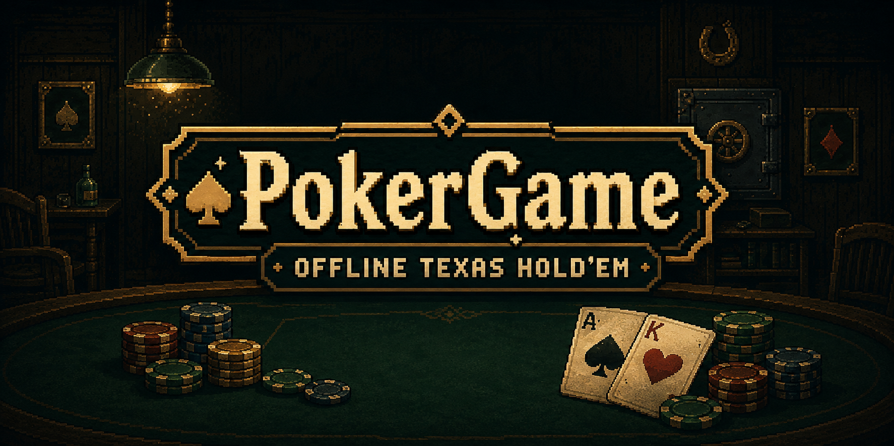
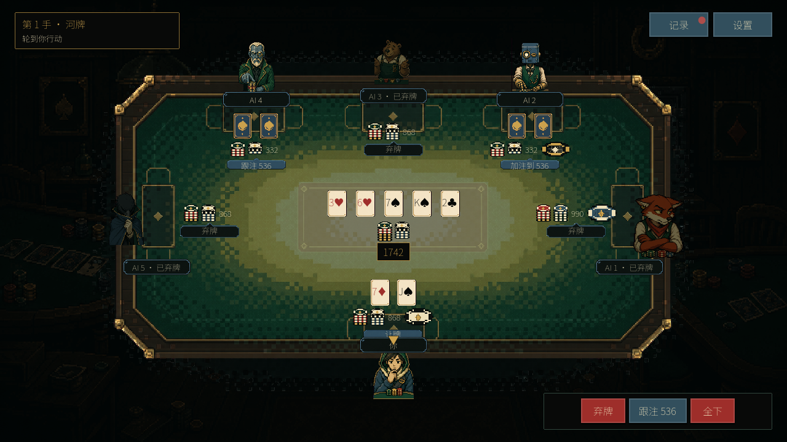

[English](README.md) · **简体中文**



# 来一手？

不想等人凑桌，就和电脑打几手。**深夜德州扑克（PokerGame）**是一款免费的单机德州扑克游戏，支持 Windows 和 macOS，下载解压就能玩。

桌上最多坐五名 AI 对手。你可以稳一点，等好牌再出手；也可以加注施压，看看谁愿意跟到底。至于全下之后会发生什么，得等牌翻开才知道。

**[去 itch.io 下载](https://jerryszz02.itch.io/poker-game)** · **[去 GitHub 下载](https://github.com/Jerryszz02/pokerGame/releases/latest)**

**单人离线 · 1 至 5 名 AI 对手 · 三档难度 · 简体中文界面**

公开 v1.1.0 下载包仍为简体中文。当前 1.2.0 源码新增设置内中英文切换、轻柔爵士背景音乐、牌桌音效和 Web 候选构建；这些改动尚未进入公开 v1.1.0 下载包。详见[当前状态与验证](docs/planning/README.md)。



*河牌已经发完。对面又下了一注，这手还跟吗？*

## 这桌怎么玩

开局可选每人 1,000、2,000、5,000 或 10,000 筹码，以及 5/10、10/20、25/50 或 50/100 盲注；一场内盲注固定。一手接一手地打，直到你赢下整桌，或者筹码归零。没有真钱下注，也不用注册账号或保持联网。

- **想单挑，还是坐满一桌？** 对手数量自己选，难度有简单、普通和困难三档。
- **别指望每个对手都一样。** 困难模式里，有的谨慎，有的爱加注，也有的喜欢跟。留意他们怎么下注，再决定这一手怎么打。
- **从入门到复盘。** 七课互动教程带你学会基本流程；练习模式可逐手暂停，结束后回放牌谱，查看本地统计和成就。
- **节奏由你定。** 动作速度可以选普通或快速，需要离开一会儿就暂停。没看清刚才谁下了多少，打开牌局记录就能查。
- **算账交给游戏。** 全下之后的边池、摊牌比大小、平局分池，都会自动处理。你只管决定下一步。


*这一手谁先下了注，记录里都能找到。*


*亮牌，收筹码。没赢也没关系，下一手还在等你。*


*选好人数和难度，点「开始牌局」就能入座。*

## 下载后就能开桌

在 [itch.io](https://jerryszz02.itch.io/poker-game) 或 [GitHub Releases](https://github.com/Jerryszz02/pokerGame/releases/latest) 下载对应系统的 ZIP 压缩包。玩游戏不需要安装 Godot、.NET，也不用下载源码。

| 系统 | 下载文件 | 怎么打开 |
| --- | --- | --- |
| Windows x64 | `PokerGame-1.1.0-windows-x64.zip` | 完整解压后，双击 `PokerGame.exe`。 |
| macOS | `PokerGame-1.1.0-macos-universal.zip` | 解压后，打开 `PokerGame.app`。 |

用鼠标操作，显示区域至少需要 **1280 × 720**。macOS 安装包包含 Apple Silicon 和 Intel 两个版本，其中 Intel Mac 尚未单独验证。

Windows 版本未签名，macOS 版本未经 Apple 公证，第一次打开时可能遇到系统安全提示。请先阅读[发布说明和文件校验信息](https://github.com/Jerryszz02/pokerGame/releases/tag/v1.1.0)，再决定是否运行。

**打到一半要走？先暂停。** 设置和打完的手牌统计会保存在本机，但当前这场对局不能存档续玩。返回主菜单或退出游戏，就要重新开桌。

## 有一手没看懂，或者发现了问题？

欢迎在 [itch.io](https://jerryszz02.itch.io/poker-game) 留言，也可以[到 GitHub 提 issue](https://github.com/Jerryszz02/pokerGame/issues)。告诉我们游戏版本、系统、对手人数和难度；如果是规则或结算问题，附一张截图或操作经过，会更容易查清楚。

游戏及宣传页面使用了部分 AI 生成的美术素材。上面的实机截图来自游戏，标题横幅是宣传图。素材来源见[第三方声明](THIRD_PARTY_NOTICES.md)和[页面素材说明](docs/storefront/README.md)。

<details>
<summary><strong>想改点东西？从源码运行</strong></summary>

v1.1.0 已包含教程、可配置筹码/盲注、牌谱回放和本地统计/成就。练习教练与画像评分尚不可用。当前源码与公开发布的区别见[状态与文档索引](docs/planning/README.md)。

使用 Godot 4 和 GDScript 构建。发布版本使用 **Godot 4.7.2 standard**，无需 .NET。在 macOS/Linux 上运行以下命令。

```sh
GODOT_BIN="$(python3 tools/bootstrap_godot.py)"
"$GODOT_BIN" --path .
```

或者，在 Godot 4.7.2 中导入 `project.godot` 并运行 `scenes/main.tscn`。

```sh
python3 tools/verify.py --godot "$GODOT_BIN"
```

[玩家指南](docs/player-guide.md) · [Runbook](docs/runbook.md) · [架构](docs/architecture.md) · [规划与验收](docs/planning/README.md)

</details>
