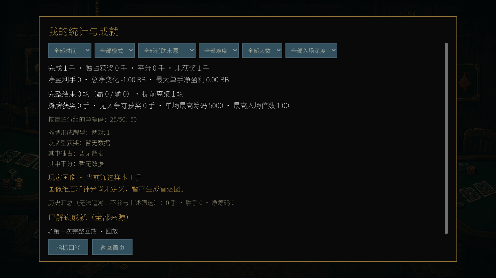

# Achievement addition for the existing v1.2.0 devlog

Target: [PokerGame 1.2.0 — Play in your browser, with music and two languages](https://jerryszz02.itch.io/poker-game/devlog/1659779/pokergame-120-play-in-your-browser-with-music-and-two-languages), post `1659779`.

Insert the image and achievement section below after “Turn up the table” and before the existing “Play PokerGame 1.2.0” link. Upload the image to itch.io and place it immediately before the heading. Append the closing invitation after that link as the final paragraph of the post. Retain the original title, cover, other sections, and release attachments.

## Insertion

### Track your achievements

PokerGame also includes local achievements to mark your progress. Complete your first lesson, finish all seven tutorials, or replay every step of a saved hand to unlock them. At the table, there are milestones for making a full house, four of a kind, or a straight flush at showdown, and for doubling your starting stack.

Open **Statistics & Achievements** from the main menu to see what you've unlocked. Your progress is saved locally.

## Closing invitation

Place this after the retained “Play PokerGame 1.2.0” link, at the end of the post:

Which achievement will you go for first? Let me know in the comments!

## Capture and save status

- Captured on 2026-09-13 at 1920 × 1080 from commit `1117a9c6956f567fb6f0086deec22dd2ddabb861`, using Godot 4.7 and `tests/practice_ui_probe.gd`. The game scripts, scenes, assets, and project settings match the `v1.2.0` tag.
- The screenshot is the unedited `1920_07_stats.png` viewport capture. The probe completed a real hand through legal actions, saved it, and traversed all replay frames to unlock the displayed achievement in an isolated profile. It did not modify the user's saves.
- Achievements were introduced in v1.1.0 and are included in v1.2.0; this addition describes the available system without claiming it first shipped in v1.2.0.
- The public post was checked and has no achievement section. The image and insertion are preserved locally, but saving them to the existing itch.io post is still pending because the browser connection repeatedly timed out. No new platform post was created.
