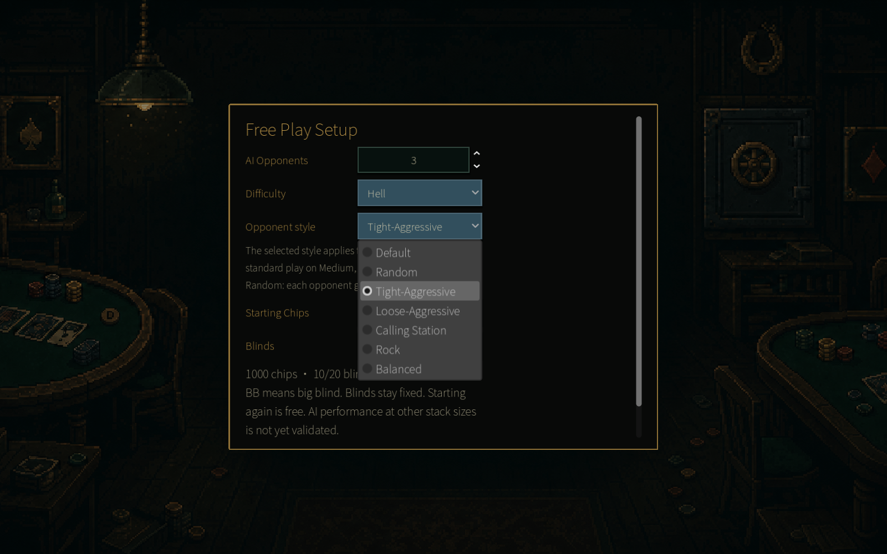
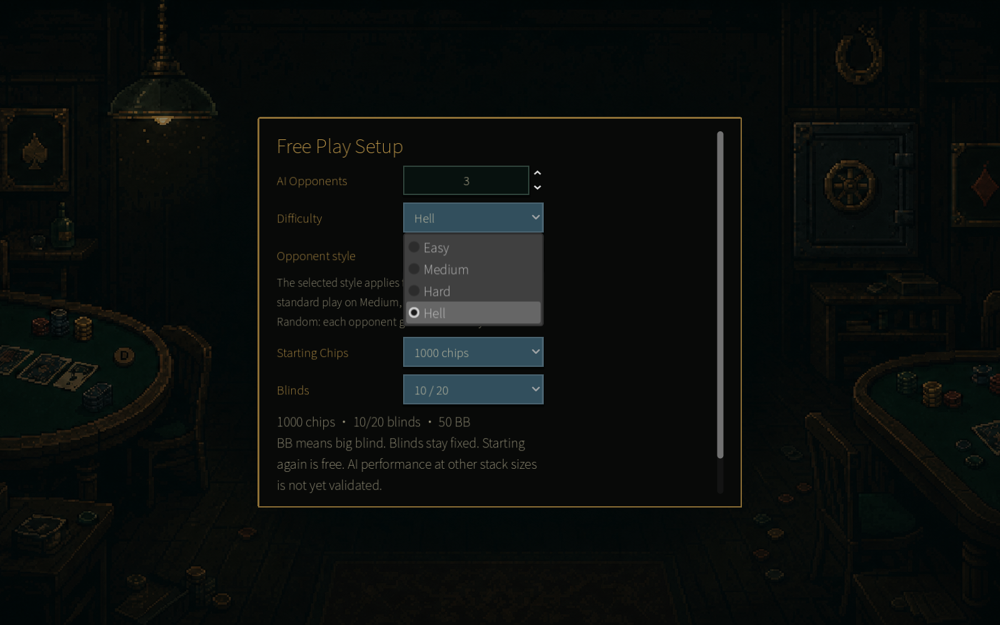
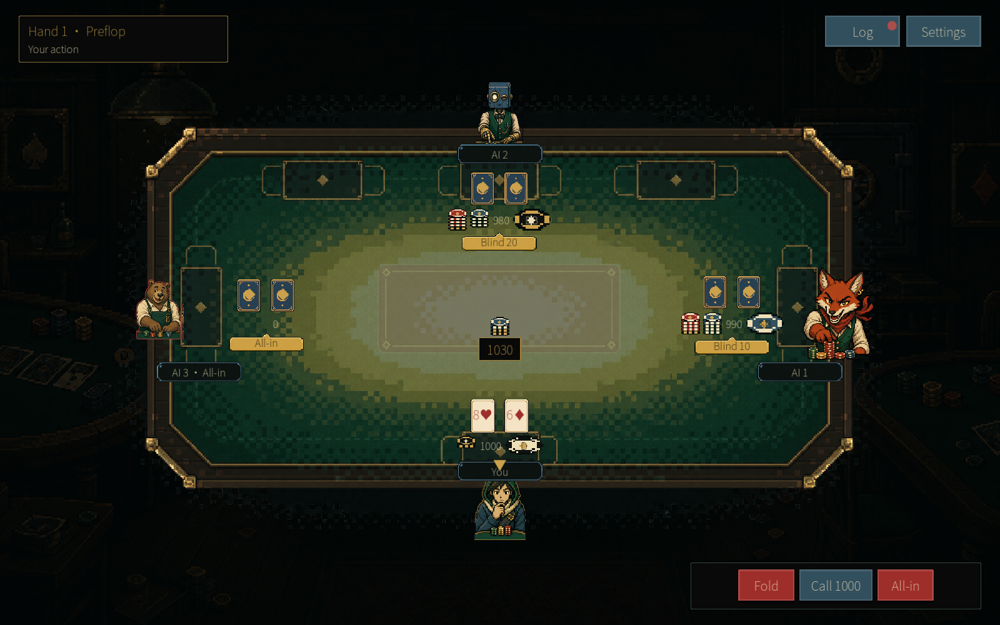
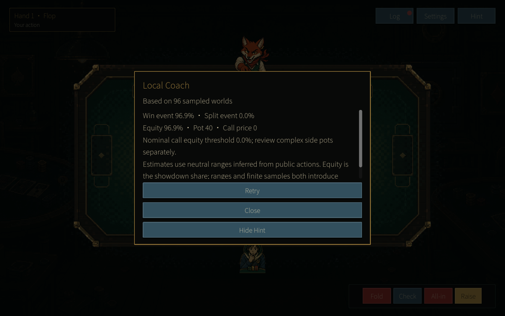
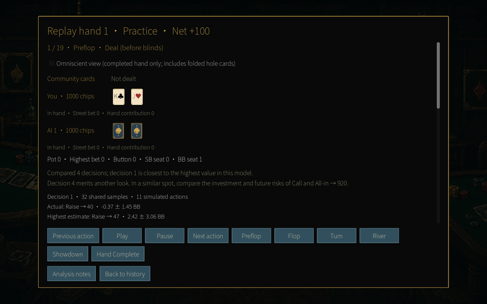
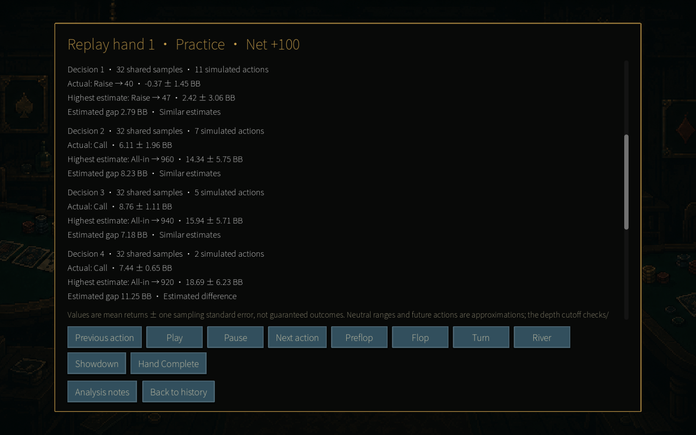
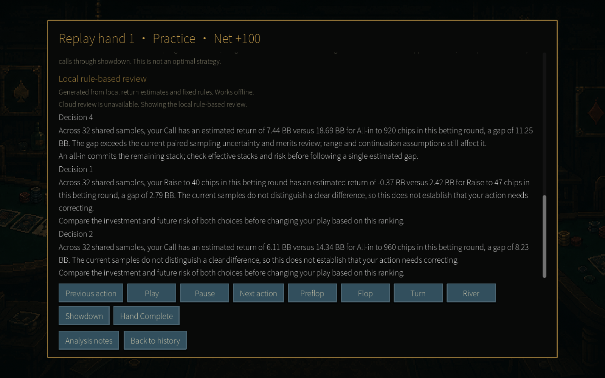
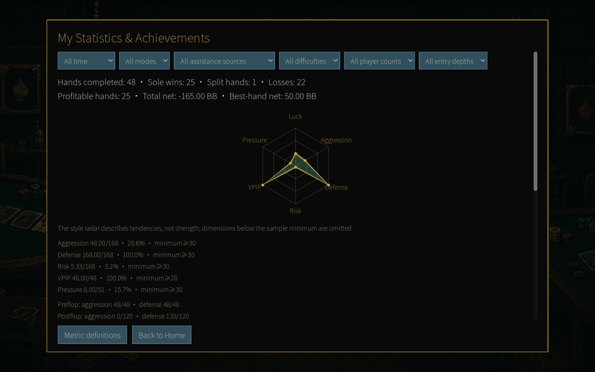

# PokerGame 1.3.0 — Know your play, choose your challenge

PokerGame 1.3.0 focuses on the decisions you make at the table. Choose the opponents you want to face, try Hell difficulty, and take a closer look at your hands with local coaching, automatic replay analysis, and a new player-style radar.

### Choose your opponents' style

Want to practice against a cautious table, or deal with players who keep raising? You can now choose **Tight-Aggressive, Loose-Aggressive, Calling Station, Rock, or Balanced** opponents when setting up Free Play or Practice.

A named style applies to the whole table. Pick **Random** to give each opponent their own randomly assigned style, or leave **Default** selected to use the difficulty's usual behavior. Your choice is remembered for the next session.

### Take a seat in Hell

**Hell** joins Easy, Medium, and Hard as a new difficulty. Its opponents explore possible continuations before choosing an action on each betting street, from preflop through the river.

Pair it with a chosen opponent style to try different kinds of pressure at the table. The AI uses a limited search and sampled estimates, so there is still room for uncertainty and variation in its play.

### Check the numbers while you practice

Open **Hint** during your turn in Practice to see the Local Coach. It estimates your chance of winning or splitting, your share of the pot at showdown, and the equity needed to cover the current call price.

The calculation uses your cards, the public board, and the action so far. It runs locally, and the panel shows how many situations were sampled. Hands where you view live advice are marked as assisted, so you can separate them in your statistics.

### Revisit the decisions that mattered

Opening a saved hand now starts an **automatic review of your decisions**. Compare the estimated return of the action you took with the highest estimate among the alternatives, expressed in big blinds, with sampling uncertainty alongside the numbers.

The review draws attention to decisions worth another look. It uses the information available when you acted, even if you switch the replay to the all-cards view. Older records without the required decision snapshots cannot be analyzed.

### Read the review, even offline

Read a plain-language summary alongside the numbers, including key decisions and a suggestion for your next session. A local rule-based review is generated from the calculated action values, so written feedback remains available without an internet connection.

When cloud coaching is available, it can provide a more detailed explanation. If the request fails, the local review stays in place; the game labels which kind of review you are reading.

### See your playing style take shape

Open **Statistics & Achievements** to find the new radar: **Luck, Aggression, Defense, Risk, VPIP, and Pressure**. VPIP tracks how often you voluntarily put chips into the pot before the flop.

The chart builds from completed hands, with sample counts and further details underneath. Each axis appears once it has enough data. It describes patterns in your decisions, so you can explore how your play changes across sessions and different tables.

[Visit PokerGame](https://jerryszz02.itch.io/poker-game)

Which opponent style will you try first, and what would you like to learn from your replays? Let me know in the comments!
