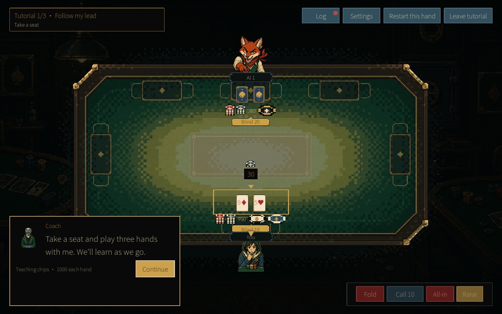
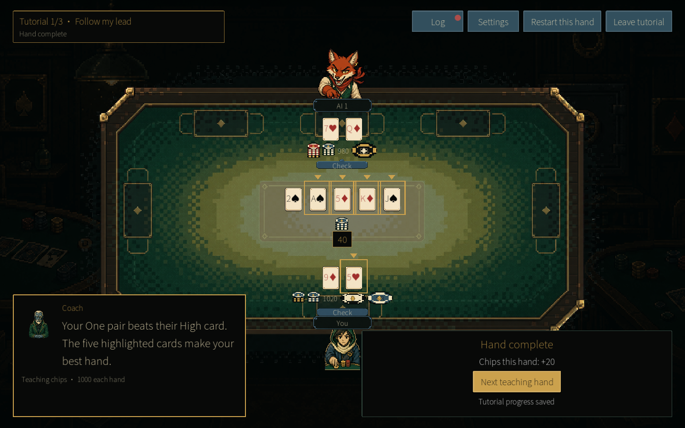
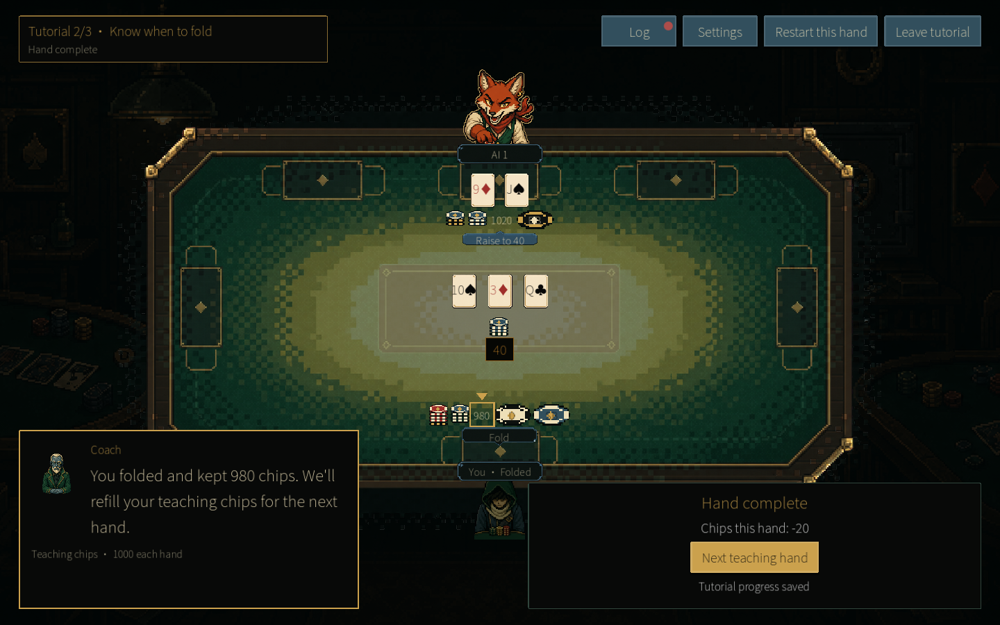
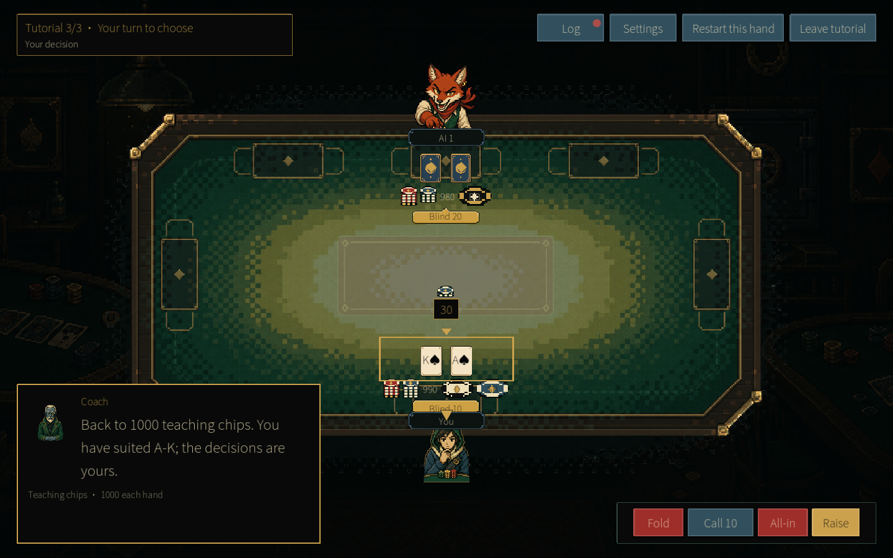
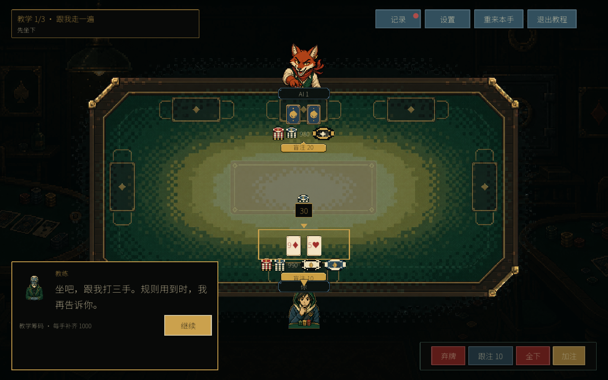

# PokerGame 1.4.0 — Learn by playing your first three hands

PokerGame 1.4.0 is available now in your browser and as Windows and macOS downloads.

This update gives beginners a new way into Texas Hold’em: sit down at the real table and play three teaching hands with a coach beside you. The earlier seven-lesson tutorial has been replaced with a continuous, hands-on introduction.

## Hand one: follow along

Start with your two hole cards and the blinds, then learn when to call and check as the flop, turn and river arrive. Short prompts explain the next step, while highlights point to the cards or controls you need. The table waits while you read; press Continue when you are ready.

## See which five cards count

At the end of the first hand, the coach explains the result and highlights the five cards that make your best hand. You can see how your hole cards and the shared board work together, right where the hand happened.

## Hand two: learn when to fold

The second hand puts you in a different position: a weak starting hand, a missed flop and an opponent asking you to pay more. The coach walks you through folding and keeping the chips you still have. Teaching chips reset to 1,000 for each new hand, so you can focus on learning the decision.

## Hand three: make your own decisions

Now you start with suited ace-king and choose your own legal actions. Try calling, raising, folding or going all-in. Help explains the raise total and the chips it will cost; an all-in explanation appears before you confirm. You can restart a teaching hand whenever you want to try again.

## Learn at your own pace, in either language

The new tutorial supports English and Simplified Chinese. Completed teaching hands are saved locally, and returning to the tutorial picks up at the first unfinished hand. Teaching hands stay separate from your normal hand history, statistics and achievements.

Choose **Tutorial** from the main menu to begin. If you already know the basics, you can leave the tutorial and head straight into a regular game.

The opponent personalities, coaching tools and replay features from 1.3.0 are still here. This update focuses on making that first seat at the table easier to take.

**Play or download v1.4.0 from the [PokerGame page](https://jerryszz02.itch.io/poker-game).**

Which part of learning poker felt hardest when you started? Try the new tutorial and let me know in the comments!
