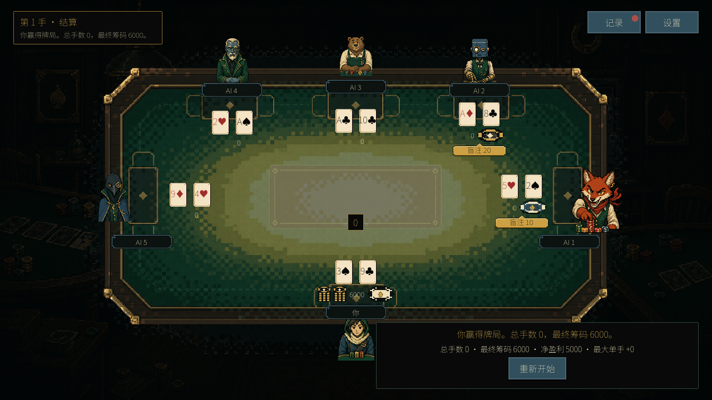
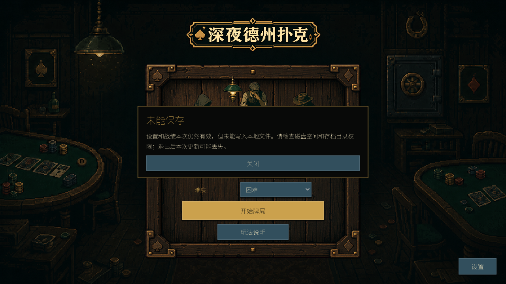

# 桌面首发验收记录：2026-09-07

当前结论：工程修复与候选构建已取得验证证据，尚未满足稳定公开首发。放行标准见 [release plan](../planning/release-plan.md)。2026-09-07 范围修订：用户要求零成本并取消 R8 真人试玩门；其余必需门仍需实际证据，历史测试结果不变。

## 版本与环境

- PR：[准备稳定桌面候选版本 #7](https://github.com/Jerryszz02/pokerGame/pull/7)，尚未合并或公开发布。
- 运行资源基线：`f47fb49e9cec34f6fe8c21cf3bfb4910fc29953a`；后续 `962627490470527b84c70af57db19b335016053d` 修改构建隔离、短测参数和验证脚本，不修改运行资源。
- 运行资源 SHA-256：`bfd26046cbc70b15288fcd688b9ebf53329f37fcc1c6861c8b110a88bcd02116`。两个平台 CI 包与本地新包均匹配；`.gitattributes` 固定 LF，消除 Windows checkout 换行造成的指纹差异。
- 引擎：Godot `4.7.2.stable.official.ed1daf0bf` 标准版；本机 macOS 26.5.1、Apple M5 Max、arm64、Metal Mobile 渲染。
- 已准备 Windows x64 + macOS 候选包；零成本约束下建议先 Windows x64 / GitHub Releases，可配 itch.io 展示页，待用户固定最终首发范围。CI 的 Windows Server 环境不等同于已验证 Windows 消费级桌面最低要求。

## 逐门结果

| 门 | 当前证据 | 结论与剩余项 |
| --- | --- | --- |
| R1 规则 | 全部定向回归通过；1,504 个独立牌型参考；固定种子 20260906 模拟 10,000 手、68,996 次行动，检查合法性、筹码、唯一牌和终止。 | 自动化门通过；不把随机模拟描述成全部可能状态的数学证明。 |
| R2 流程 | 原生包自检覆盖 1/3/5 AI × 三档难度；后台 AI 暂停、日志、取消、重开、过期输入回归通过；窗口探针新增多人出局、玩家胜利及重开。 | 自动化门通过。 |
| R3 响应/稳定 | 当前最大化启动版本完成 30 分钟、2,214 次 AI 行动、178 手；P95 8.655ms、P99 9.592ms，AI 工作期间 P99 9.192ms；节点、对象、动画数量稳定。 | 本机窗口门通过；完整报告的资源指纹与候选包一致。 |
| R4 理解/操作 | 帮助与离桌确认、偏好类型恢复与写入失败回归；可见音效/节奏开关调用实际行为并保存；保存失败弹窗已经截图审查。 | 软件行为检查通过，实际设备音效仍需 R7；真人理解反馈为可选，未声称通过。 |
| R5 视觉/资源 | 1280×720、1440×900、1920×1080 窗口流程与文本/边界断言通过；Noto Sans SC 与花色自检通过；字体/引擎许可随包；独立 macOS 程序首次打开的最大化布局已观察。 | 本地检查通过，Windows 图形设备仍待 R7。 |
| R6 可重建 | [f47fb49 CI](https://github.com/Jerryszz02/pokerGame/actions/runs/34097377695) 三个任务通过；Windows/macOS 各自在原生系统导出和运行实际模板自检；下载 CI artifact 后逐包校验 SHA-256。 | 基线 CI 通过，审查修复已推送并通过本地包检查；最终提交的 CI 状态以 PR 关联检查为准，发布时再次核对。 |
| R7 目标平台 | macOS 从非源码目录打开真实程序、检查启动菜单；实际包在禁止联网的进程沙箱中完成 9 组自检。签名完整性检查退出 0，Gatekeeper 退出 3 / rejected。 | 未通过：Windows 图形设备、完整目标设备流程、macOS 所选分发路径的签名/下载隔离体验缺证据。 |
| R8 真人试玩（已取消） | 用户于 2026-09-07 明确移出 Goal；保留[可选匿名记录模板](playtest-template.md)。 | 不再阻塞发布；没有收到真实反馈，不记为验收通过。 |
| R9 公开首发 | ready PR 已建立，两项有效审查意见均在 9626274 修复、复验、推送并关闭；没有稳定版标签、公开 Release 或重下载运行证据。 | 未通过；禁止把 CI artifact 或本地包写成已公开首发。 |

## 可追溯包

以下都是候选包，不能作为全部发布门已通过的标志。manifest 明确保留 `public_release_ready: false`。不同构建的 ZIP 哈希可以不同，验证时必须对应具体包，不能只核对版本名。

| 包 | 提交/来源 | SHA-256 | 证据 |
| --- | --- | --- | --- |
| Windows x64 CI | f47fb49 / 上述 CI | `070a63a8f3e96a80d5d4029f7dde2e58c8d8a58610e2043821d9715156ad7f00` | [manifest](evidence/2026-09-07/ci-f47fb49-windows-manifest.json) |
| macOS Universal CI | f47fb49 / 上述 CI | `c1ebb4253f687a8d2a916b606b29488ce8dc38ee7b65994414fed1922f3316fe` | [manifest](evidence/2026-09-07/ci-f47fb49-macos-manifest.json) |
| macOS Universal 本地 | 9626274 / 干净 checkout | `65f25d88087e5cc91451eb6a8f7bcc7a5f8e7d150ad96bf4e8462812253d36eb` | [manifest](evidence/2026-09-07/local-9626274-macos-manifest.json) |

Universal 包包含 Intel 可执行内容，不代表 Intel 已验证。实际图形观察与联网禁用测试使用本地 f47fb49 包，其身份、签名结果和验证边界见 [macOS 部分验证记录](evidence/2026-09-07/macos-platform-partial.json) 与 [离线包日志](evidence/2026-09-07/offline-f47fb49-macos.log)。没有更改系统 Gatekeeper 配置或为程序添加安全例外。

## 性能、回归与截图

[固定 AI 场景记录](evidence/2026-09-07/ai-benchmark.json)使用 1/5 个对手、翻牌/转牌/河牌，每组 5 次。观察到工作耗时约 572–732ms，包含快照和轮询开销；计算在后台，不能用这个数字替代 UI 帧响应。场景和洗牌种子固定，AI 选择与 Monte Carlo 抽样仍随机。

[当前 f47fb49 完整长测](evidence/2026-09-07/ui-stability-f47fb49.json)覆盖最大化启动配置：30 分钟、2,214 次 AI 行动、178 手，P95 8.655ms、P99 9.592ms、AI 工作期间 P99 9.192ms。120 秒至结束，节点保持 41、对象保持 1,675、动画与孤儿节点保持 0；静态内存增长约 3.94MB（含探针帧样本），无错误日志。该运行资源指纹与上述 Windows/macOS 包一致。

[872a7cd 的完整长测](evidence/2026-09-07/ui-stability-872a7cd.json)：30 分钟、2,244 次 AI 行动、172 手，P95 8.666ms、P99 8.811ms、AI 工作期间 P99 8.783ms；节点 41、动画 0、孤儿节点 0，120 秒后内存增长约 3.93MB。这个结果属于其记录的旧资源指纹，不替代当前最大化启动配置的完整长测。

审查修复的本地复验：在旧 `export/windows` 放置测试 PCK 后，用真实 Godot 导出；新 ZIP 只包含当前 EXE、README 和许可，旧文件保留且未进入新包。短测包装器完成 `-- --seconds=15 --min-ai=1`，报告 15 秒、23 次 AI 行动、`full_release_duration: false`。macOS 使用独立临时导出目录后的原生包自检通过。没有手动请求再次审查。

最小分辨率截图：以下终局为测试置入状态，只用于验证布局与操作，不作为自然完成比赛或真人试玩的证明。

## 继续放行需要的输入

需要固定目标平台/渠道，提供可用 Windows 图形设备；若包含 macOS，需确定分发/签名路径并完成下载验证。随后修正技术验收发现的问题、重验受影响项，完成最终提交的 CI/必要审查，受控 squash 合并，公开发布并重新下载验收。凭据不进入仓库或试玩记录。
